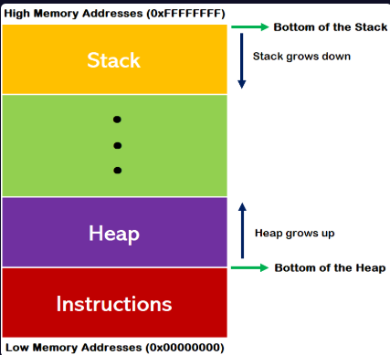
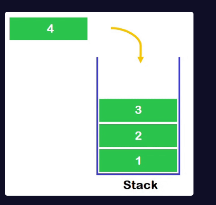
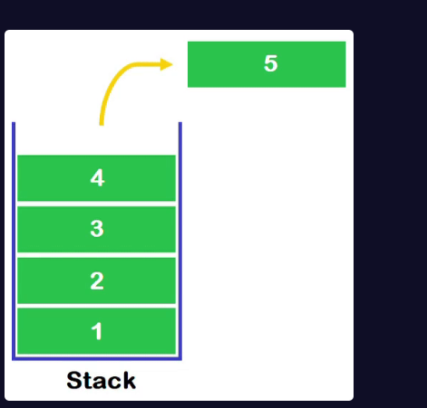
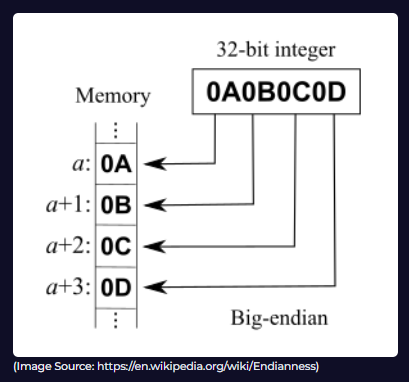
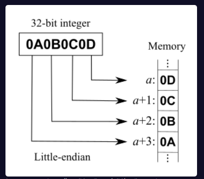

### **CƠ BẢN VỀ MEMORY**
---

### **Memory là gì?**
Bộ nhớ là một trong những đơn vị phần cứng cơ bản nhất của máy tính, đóng vai trò quan trọng trong việc chạy các chương trình và vận hành hệ thống. Khi máy tính khởi động, **hệ điều hành** – một loại phần mềm hệ thống – được nạp vào bộ nhớ. Bộ nhớ hoạt động như một đơn vị lưu trữ tạm thời trong suốt quá trình thực thi chương trình. 

Ngày nay, các chương trình thường sử dụng bộ nhớ để lưu trữ dữ liệu vì khối lượng dữ liệu quá lớn, vượt xa khả năng lưu trữ của các biến trong bộ xử lý. Trong bộ nhớ, có những **cấu trúc dữ liệu đặc biệt**, mỗi cấu trúc có chức năng riêng biệt để hỗ trợ hoạt động của chương trình.

**Lưu ý**: Phân tích bộ nhớ ở cấp hệ thống là một chủ đề nâng cao, đặc biệt quan trọng với các nhà phân tích SOC (Security Operations Center). Họ cần hiểu rõ về bộ nhớ và có khả năng thực hiện phân tích bộ nhớ khi cần thiết. Bạn có thể tham khảo khóa học "Memory Forensics" tại: [https://app.letsdefend.io/training/lessons/memory-forensics](https://app.letsdefend.io/training/lessons/memory-forensics).

---

### **Stack và Heap là gì?**
Bộ nhớ được chia thành nhiều vùng khác nhau, trong đó **Stack** và **Heap** là hai khu vực quan trọng:

- **Stack **: Là một phần bộ nhớ được cấp phát khi chương trình khởi chạy. Stack lưu trữ các **biến cục bộ** và **đối số của hàm** trong chương trình. Đây là khu vực có kích thước cố định và được quản lý chặt chẽ bởi hệ thống.
- **Heap *: Là vùng bộ nhớ được dự trữ trong quá trình chương trình chạy. Heap chứa các **biến động** (dynamic variables) được tạo ra trong lúc thực thi. Không giống stack, heap không lưu trữ biến tĩnh và có kích thước lớn hơn, đồng thời cung cấp sự linh hoạt cao hơn trong hệ điều hành.

---

### **Cách hoạt động của Stack và Heap**
- **Stack**: Khu vực này mở rộng từ **địa chỉ bộ nhớ cao xuống địa chỉ thấp**. Khi chương trình gọi một hàm, các biến cục bộ và thông tin liên quan được đẩy vào stack; khi hàm kết thúc, chúng được xóa khỏi stack.
- **Heap**: Ngược lại, heap mở rộng từ **địa chỉ bộ nhớ thấp lên địa chỉ cao**. Nó được sử dụng để cấp phát bộ nhớ động, ví dụ như khi chương trình yêu cầu thêm không gian lưu trữ trong quá trình chạy.

---

### **Các thao tác trên Stack**
Stack hoạt động theo nguyên tắc **LIFO (Last In First Out - Vào sau ra trước)**, nghĩa là dữ liệu được thêm vào sau cùng sẽ được lấy ra đầu tiên. Có hai thao tác chính trên stack:

1. **Push**: Đẩy dữ liệu vào stack. Dữ liệu mới được đặt lên **đỉnh stack** (top of the stack). Mỗi dữ liệu trong stack có một địa chỉ bộ nhớ riêng, và việc truy cập được thực hiện thông qua thanh ghi **ESP (Extended Stack Pointer)**.
   - **Ví dụ**: Nếu bạn đẩy các giá trị "A", "B", "C" vào stack lần lượt, "C" sẽ nằm trên cùng.

   
2. **Pop**: Lấy dữ liệu ra khỏi stack. Dữ liệu ở đỉnh stack (vào sau cùng) sẽ được lấy ra trước.
   - **Ví dụ**: Trong stack chứa "A", "B", "C" (với "C" trên cùng), thao tác pop sẽ lấy "C" ra trước, để lại "A" và "B".

---

### **Endianness là gì?**
**Endianness** là cách mà bộ xử lý truy cập dữ liệu trong bộ nhớ, dựa trên cách sắp xếp các byte. Có hai kiểu chính:

- **Big Endian**: Byte ở **địa chỉ nhỏ nhất** trong bộ nhớ khớp với **byte có giá trị lớn nhất** (most significant byte) trong thanh ghi. Dữ liệu được đọc từ trái sang phải theo thứ tự giảm dần độ quan trọng.
  - **Ví dụ**: Với số 0x1234, trong Big Endian, byte 0x12 được lưu trước, sau đó đến 0x34.

- **Little Endian**: Byte ở **địa chỉ nhỏ nhất** trong bộ nhớ khớp với **byte có giá trị nhỏ nhất** (least significant byte) trong thanh ghi. Dữ liệu được đọc từ phải sang trái.
  - **Ví dụ**: Với số 0x1234, trong Little Endian, byte 0x34 được lưu trước, sau đó đến 0x12.

**Hình minh họa**: Bạn có thể tham khảo hình ảnh minh họa về Big Endian và Little Endian tại [Wikipedia](https://en.wikipedia.org/wiki/Endianness).

---

### **Tóm tắt**
- **Memory (Bộ nhớ)**: Đơn vị lưu trữ tạm thời cho chương trình và hệ điều hành, chứa các cấu trúc dữ liệu đặc biệt.
- **Stack**: Vùng bộ nhớ cho biến cục bộ và đối số hàm, hoạt động theo nguyên tắc LIFO, mở rộng từ địa chỉ cao xuống thấp.
- **Heap**: Vùng bộ nhớ cho biến động, lớn và linh hoạt hơn stack, mở rộng từ địa chỉ thấp lên cao.
- **Endianness**: Cách sắp xếp byte trong bộ nhớ, gồm Big Endian (byte lớn trước) và Little Endian (byte nhỏ trước).

## Bài viêt này tham khảo từ letsDefend.io